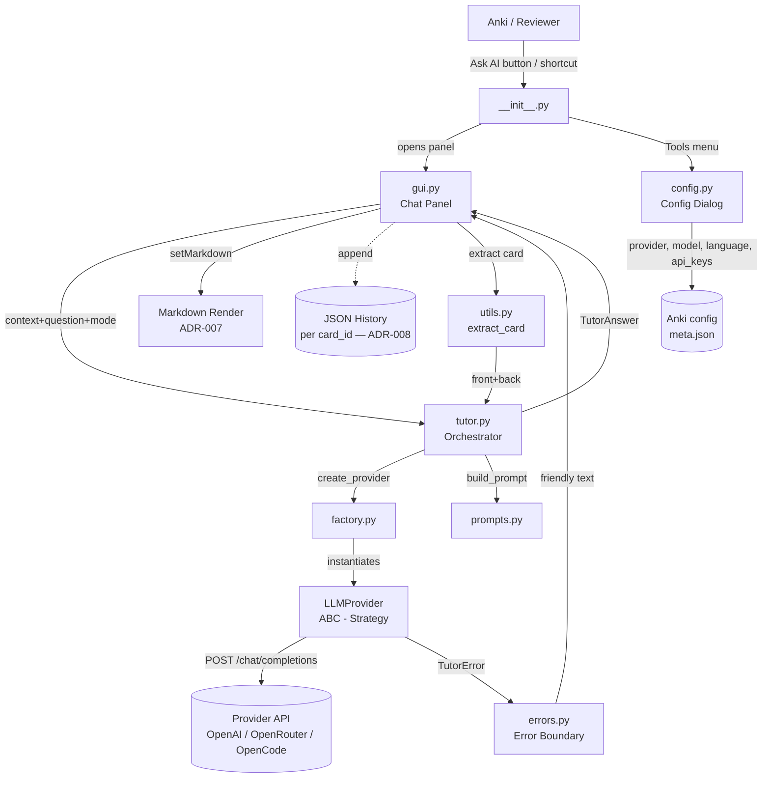
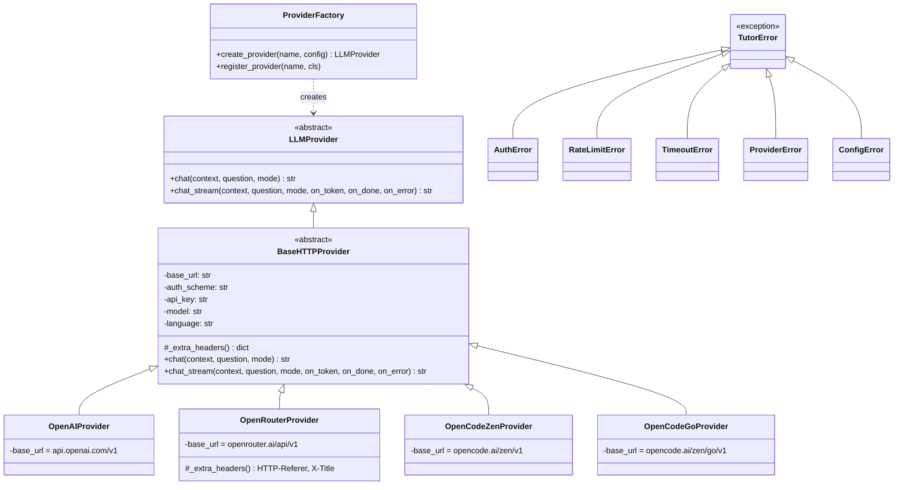

# Architecture

## Overview

AnkiTutor is an Anki add-on that adds an AI tutor to the card reviewer. The user clicks a button, asks a question about the current card, and receives a streamed Markdown answer from an LLM provider — without freezing the Anki UI.

## File structure

```
anki-tutor/
├── __init__.py          Entry point: hooks, menu, shortcut
├── manifest.json        Add-on metadata
├── config.json          Default config (example, no real keys)
├── config.py            Config dialog (QDialog) + live model fetch
├── tutor.py             Orchestrator: builds context, calls provider
├── gui.py               Chat panel (QDialog) + TutorWorker (streaming)
├── prompts.py           System prompt builder (context + mode + language)
├── utils.py             Card extraction, HTML stripping, save-to-note
├── history.py           Per-card history in history.json
├── errors.py            TutorError hierarchy (ADR-005)
├── providers/           Strategy/Factory for LLM backends
│   ├── base.py          LLMProvider ABC + BaseHTTPProvider
│   ├── factory.py       create_provider / register_provider
│   ├── openai.py        OpenAIProvider
│   ├── openrouter.py    OpenRouterProvider
│   └── opencode.py      OpenCodeZenProvider + OpenCodeGoProvider
└── tests/               Offline test suite (pytest)
```

## Data flow

```
[Reviewer Card]
    │  front + back (extracted by utils.py)
    ▼
[tutor.py] ──context──► [LLM Provider] ──token stream──► on_token / on_done / on_error
    │                (OpenAI / OpenRouter / OpenCode)
    │  TutorAnswer (answer, question, mode, card_id, deck_id, provider, model, ts)
    ▼
[gui.py] → worker off UI thread receives tokens → renders Markdown incrementally
    → appends to per-card JSON history (history.py)
```

1. Hook injects "Ask AI" button into Anki's reviewer
2. On click, `utils.py` extracts front/back from the current card
3. `tutor.py` builds the prompt with context + question + mode
4. Calls the provider in streaming mode (`chat_stream`); tokens arrive via `on_token`
5. `gui.py` renders the response as **Markdown** (ADR-007); errors become friendly text
6. The Q&A pair is saved to per-card history (ADR-008)

## Component diagram



## Class diagram (Strategy + Factory + Template Method)



## Key patterns

| Pattern | Where | Purpose |
|---|---|---|
| **Strategy** | `LLMProvider` + 4 implementations | Swap LLM backends without changing UI |
| **Factory** | `create_provider()` / `register_provider()` | Select provider by config name |
| **Template Method** | `BaseHTTPProvider.chat()` + `_extra_headers()` hook | Share HTTP logic across providers |
| **Observer** | `chat_stream()` callbacks (`on_token`/`on_done`/`on_error`) | Stream tokens to the GUI without coupling |
| **Error Boundary** | `TutorError` hierarchy caught in `gui.py` | Never crash Anki on API failures |

## Constraints

- Runs inside Anki's embedded Python (stdlib + `requests`/`httpx` only)
- PyQt6 already bundled with Anki — use for GUI, don't install
- Config managed by Anki's `addonManager`, not `.env`
- Tests must run offline, without Anki (`FakeProvider`)
